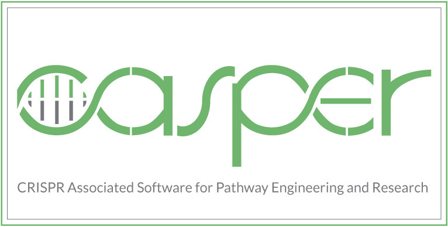

# CASPERapp



Software for Enhanced guide-RNA Design and Targeting Analysis for Precise CRISPR Genome Editing of Single and Consortia of Industrially Relevant and Non-model Organisms. This software is a GUI interface for the following paper:

Brian Mendoza and Cong T. Trinh. 2017. Enhanced Guide-RNA Design And Targeting Analysis For Precise CRISPR Genome Editing Of Single And Consortia Of Industrially Relevant And Non-Model Organisms. DOI: https://doi.org/10.1093/bioinformatics/btx564

Thank you for your interest in CASPER. Our packaged releases for Windows 10, MacOS, and Ubuntu 18.04 will be posted soon. In the meantime, you can run CASPERapp with python3 following the directions below.

### How to run CASPERapp using python3:
1) Clone the repository using the command: ```git clone https://github.com/TrinhLab/CASPERapp```
2) Ensure that you have Python3 installed on your computer (Python 3.8 recommended).
3) _Recommended: Create and enter virutal environment:_ ```virtualenv <env_name> && source <env_name>/bin/activate```
4) Install dependecies with pip: ```pip install -r requirements.txt```
5) Run CASPER!  Simply cd into the CASPERapp-master directory (wherever you put it) and run the command: ```python3 main.py```
   
CASPER will launch and you will be good to go! If you have any problems, please email David Dooley at ddooley2@vols.utk.edu

