# Packaging CASPERapp

## Windows 10

### Clone CASPERapp and Install Dependencies
1) Ensure git and python 3 is installed in your system (python 3.6-3.8 recommended).
2) Clone the repository using your local terminal by running the following command:
```git clone "https://github.com/TrinhLab/CASPERapp"```
3) CD to the CASPERapp directory.
4) (OPTIONAL) Create a python 3 virtual environment before installing dependencies.
5) Install CASPERapp dependencies using git and the provided requirements.txt file:
```pip install -r requirements.txt```

### Packaging CASPERapp executable using pyinstaller
NOTE: Pyinstaller uses the .spec files located in the CASPERapp directory for packaging the project into executables. Each major OS has its own spec file. If new files are added to the project (.ui, .txt, etc.) they need to be added into the spec file so pyinstaller knows to include these files in the executable build. 

1) CD to the CASPERapp directory
2) Run pyinstaller with the windows.spec file:
```C:\Users\Tfry\AppData\Local\Programs\Python\Python36\Scripts\pyinstaller.exe main.spec```
NOTE: If your pyinstaller installation is linked to your global system variables, you do not need to include the full path to the pyinstaller.exe to run it; otherwise, you will need to know the full path to the pyinstaller.exe to run it.
3) Pyinstaller will now build the CASPERapp project into an executable. The result of this process will create two new folders in the CASPERapp directory: build and dist.
You do not need the build folder, only the dist folder is needed. In the dist folder there should be a folder labeled CASPERapp, this folder holds the CASPERapp.exe file, and all other files needed for the .exe to run (.dll, .ui, etc.).

### Creating a windows installer for the CASPERapp executable build
NOTE: Make sure Inno Setup Compiler is installed. Version 6.2.0 was used for this documentation. A new Inno Setup Compiler script will need to be generated on your own machine to be able to create an installer for
CASPERapp. The steps below will walk through everything needed to create this script and compile it.
1) Open Inno Setup Compiler
2) You should be prompted with the following screen, select "Create a new script option file using the Script Wizard"
and click "OK".

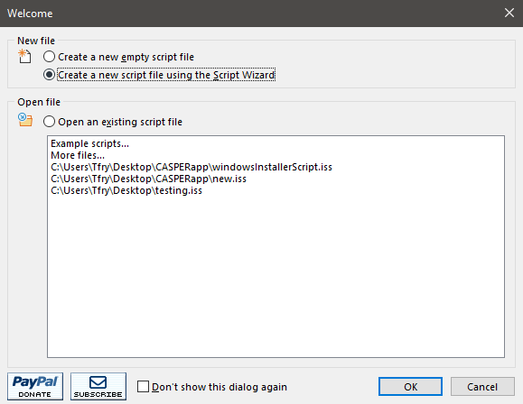

3) Next, make sure "Create a new empty script file" is UN-checked and click "Next".

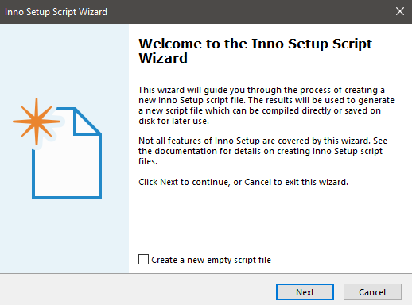

4) Next, fill out the forum with the appropriate application information and click "Next".

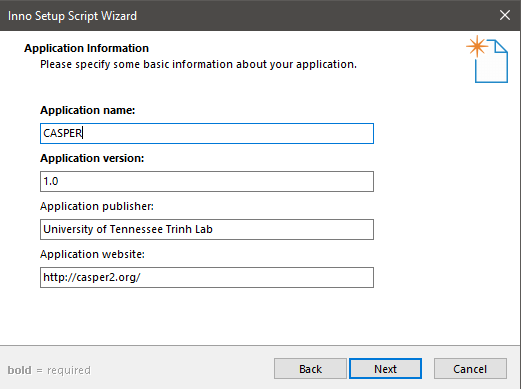

5) Next, leave the default information selected and click "Next".

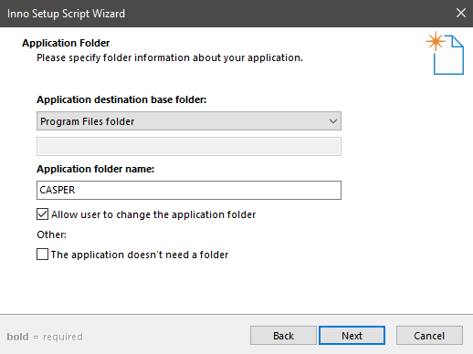

6) Next, select the path to the CASPERapp.exe file generated by pyinstaller. Then use the "Add folder" option
to select the CASPERapp folder that is INSIDE the dist folder generated by pyinstaller. After selecting this folder
Inno will prompt with a question asking if you want to include all files within sub-folders in this directory,
select "Yes", then click "Next".

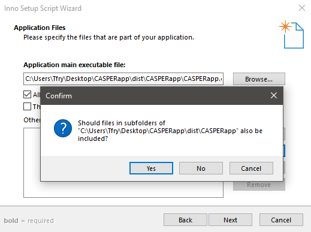

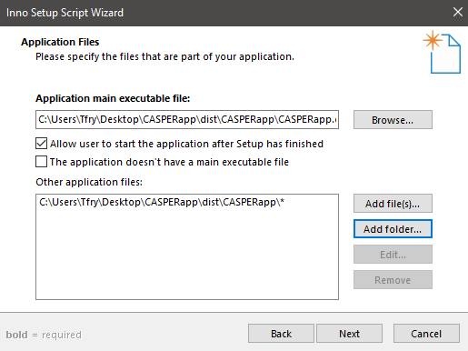

7) Next, leave the default information selected and click "Next".

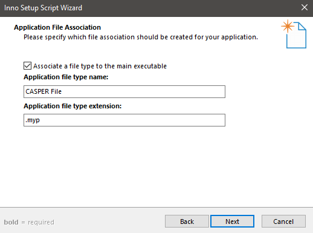

8) Next, leave the default information selected and click "Next".

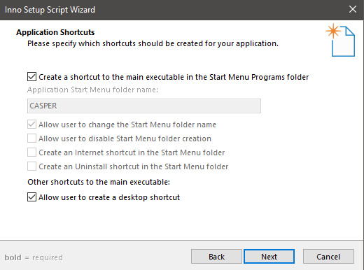

9) Next, select the license file (LICENCE) in the CASPERapp directory, leave the other two
options blank and click "Next".

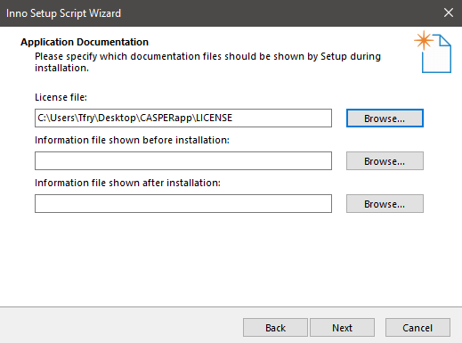

10) Next, make sure "Administrative install mode" is selected and click "Next".


11) Next, make sure "English" is selected and click "Next".

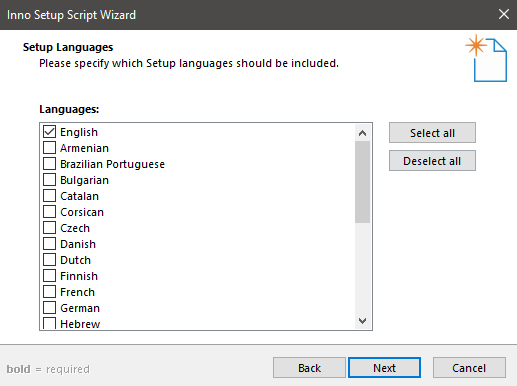

12) Next, set the compiler output path and compiler name. I would suggest outputting the installer to the Desktop
and naming the installer "CASPER_setup". You can set a custom icon if desired. DO NOT set a password for the installer. Once
finished, click "Next".

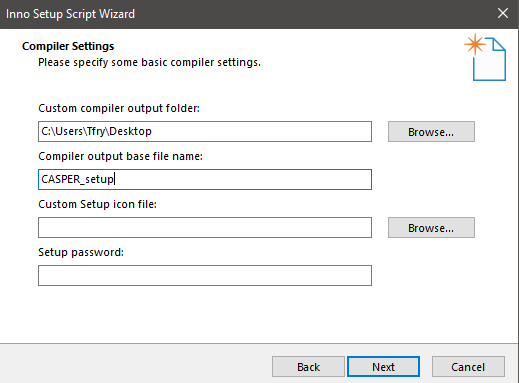

13) Next, leave the default information selected and click "Next".

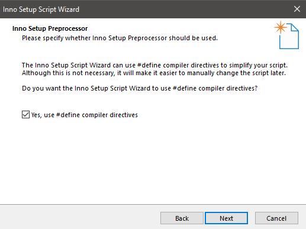

14) Next, click finish to generate the .iss file.

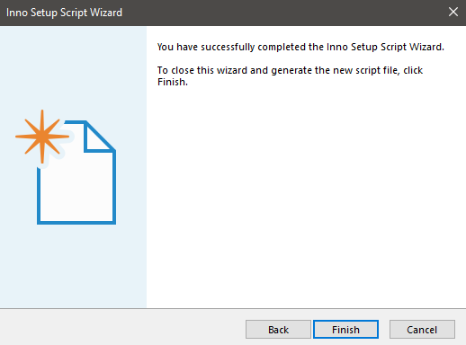

15) Next, when prompted to compile the new script, select "No".

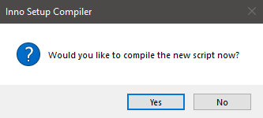

16) Next, the icon file needs to be set for the CASPERapp.exe file. To do this add ```IconFilename: "{app}\cas9image.ico"``` to the end of both lines under the [Icons] section.

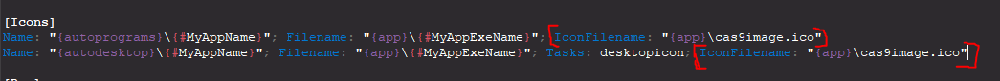

17) Next, the install directory for CASPERapp needs to have R/W permissions. To do this add ```Permissions: everyone-modify``` at the end of the source line referring to the CASPERapp directory.

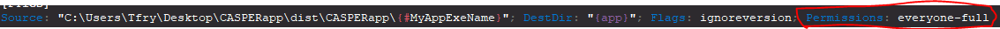

18) Next, CASPERapp.exe needs permission to be set. To do this add ```Permissions: everyone-full``` at the end of the source line referring to the CASPERapp.exe.


19) Next, add "runascurrentuser" to the installer file, to do this add ```runascurrentuser``` at the end of the last line of the script.

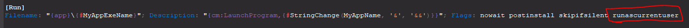

20) Next, x64 architecture needs to be set, to do this add ```ArchitecturesInstallIn64BitMode=x64``` below ```WizardStyle=modern```.

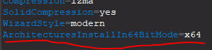

18) Lastly, save the .iss file by clicking the "save" icon in the toolbar. Then Compile the script using the "play"
icon in the toolbar. This will generate the installer file for CASPERapp and output to the Desktop (or wherever your
selected compiler output is). Once this is finished, run the installer and install CASPERapp to verify it installs
and launched correctly.

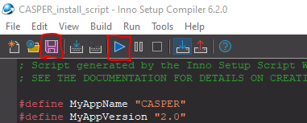

### Helpuful Notes
* Make sure you test the CASPERapp.exe before going through making the installer. The executable created by pyinstaller should be running and working properly.
* Once you have created the installer, install CASPERapp and run the program to verify it is working. Be sure to test Population Analysis and generate a 3D graph to ensure that the install directory has the correct R/W permissions because Population Analysis writes to temp.db in the install directory. If the program crashes when trying to run the analysis, make sure the .iss script has the correct permissions being set as described in the tutorial above. 
* If you install CASPER after creating an install script, and CASPER fails to start, go back to the pyisntaller executable created to verify it is working. Most of the time the executable created by pyisntaller is what is not working so those issues need to be sorted before creating an installer.